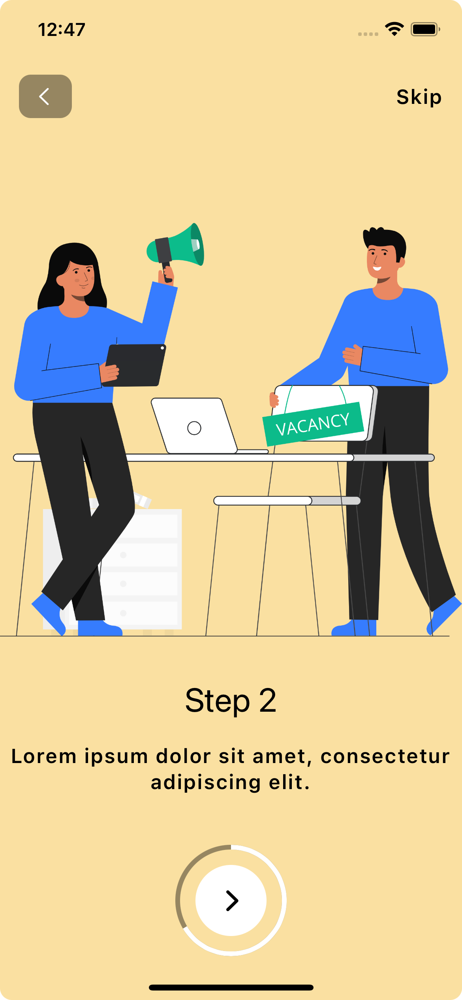

  

Basic onboarding screen written with SwiftUI.

## Features

- [x] Present pages.
- [x] Next, Skip, and Back buttons.

## Technology and API

- SwiftUI
- AppStorage
- Responsive next button that shows progress

## Requirements

- Xcode > 14.0
- Swift > 5.0

## How to run
1. Clone the repo
2. Open OnboardingScreen.xcodeproj
3. Select a simualtor and click on run (CMD+R)

## Contact

iOS Developer - Can Dayan – hcdayan@hotmail.com – [@Linkedin](https://www.linkedin.com/in/can-d/) – [@Medium](https://activesludge.medium.com/) - [@Stackoverflow](https://stackoverflow.com/users/12594970/active-sludge)
____

 

##### Disclaimer:  The images do not belong to me. This project is done just for practice and learning purposes.